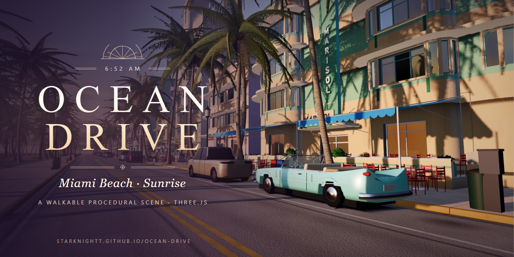
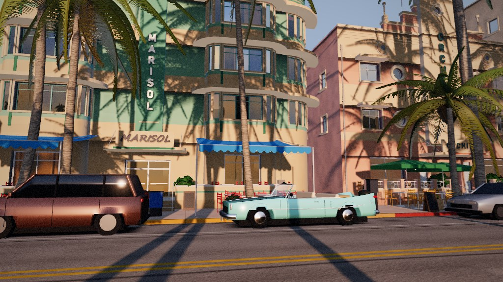
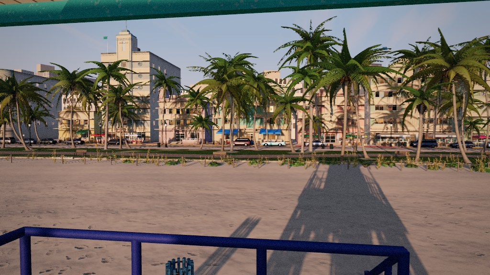
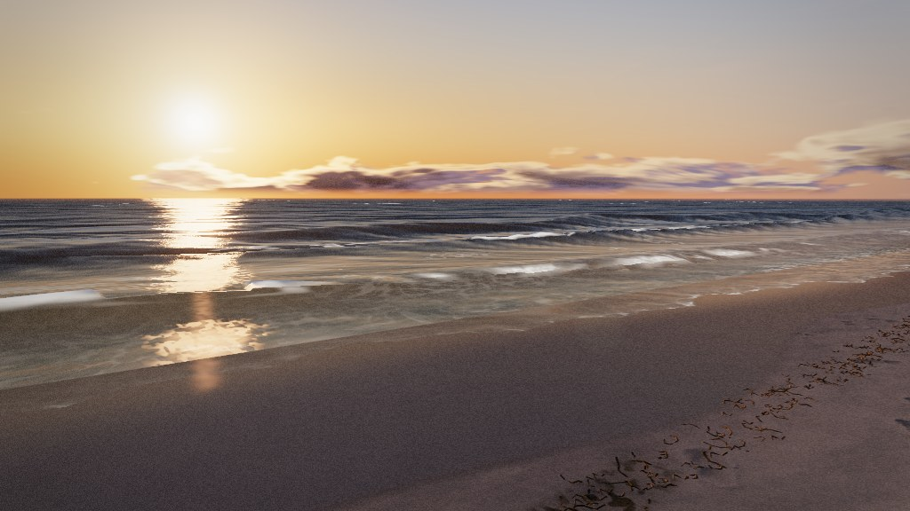
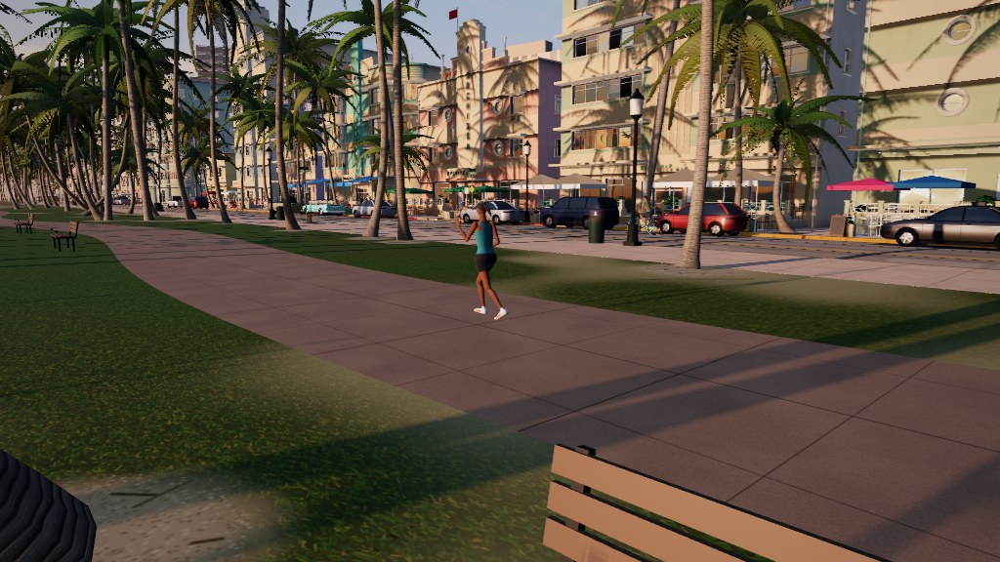
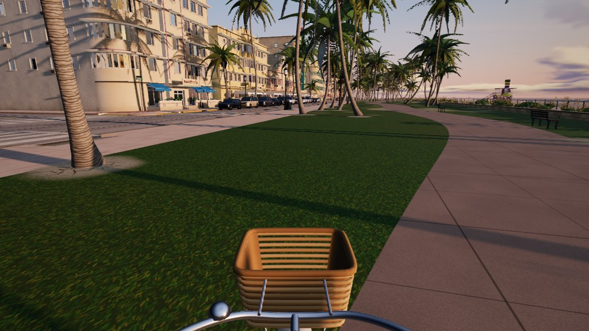
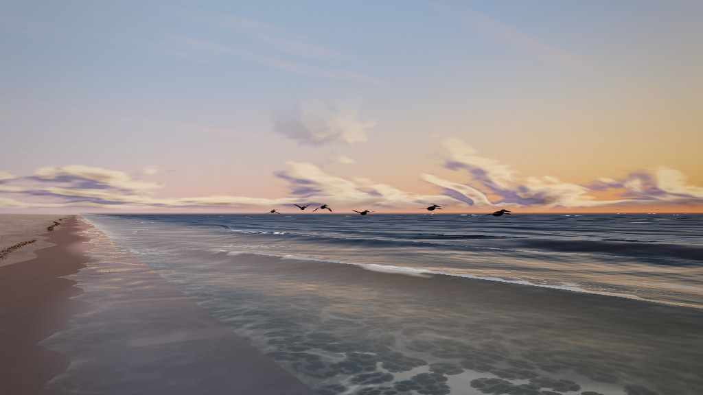

# Ocean Drive

A first-person walk along Ocean Drive in Miami Beach at sunrise, built in Three.js. The sun is a
hand's width above the Atlantic, the pastel Art Deco hotels are lit gold, and the palms throw
shadows the length of the street. You can walk the sidewalk past the cafés, cross to the park,
climb a lifeguard tower and go down to the water, where the swash runs in around your feet.
Everything on screen and everything you hear is generated in code at load time: the hotels, the
palms, the cars, the sand, the ocean, the sky, the signs and every sound. The scene loads no
image, model, font or audio files (the only images in the repository are the screenshots in this
README), and the hotels are invented: there is no real name or brand anywhere in the scene.



**Walk it: https://starknightt.github.io/ocean-drive/**

**The brief it was built from: [PROMPT.md](PROMPT.md).** One page, unedited, with a list at the
end of where the scene went beyond it.

It runs best on a desktop GPU in a Chromium-based browser, and it was built and measured on an RTX
4060. It also runs on laptops and phones, on a lower quality tier.

## Running it locally

```
git clone https://github.com/StarKnightt/ocean-drive.git
cd ocean-drive
npm install
npm run dev        # http://localhost:5173
npm run build      # production build into dist/
```

The only runtime dependency is `three` (0.186). The build uses a relative base, so `dist/` works
from any sub-path; every push to `main` deploys it to GitHub Pages through
`.github/workflows/deploy.yml`.

The Playwright scripts in `tools/` need the dev server running: `shots.mjs` captures the five
fixed critic cameras, `walk-test.mjs` walks the route from the sidewalk to the water,
`ride-test.mjs` and `vehicle-sim-test.mjs` check the bike, the ATV and the convertible (`car-ride-test.mjs`
runs the convertible's enter / drive / exit flow in Node; `traffic-sim-test.mjs` and
`traffic-visual-test.mjs` check the traffic in Node), and `mobile-test.mjs` runs
the touch controls on an emulated phone.



## Controls

| Input | Action |
|---|---|
| Click | Start walking: locks the pointer (the sound starts on the same click) |
| Mouse | Look |
| W A S D | Walk |
| Shift | Walk faster |
| Space | Jump |
| E (or F) | Get on or off the beach cruiser or the lifeguard ATV, or into / out of the convertible, any parked car, or a stopped traffic car at its driver's door (the driver gets out and waves) |
| W S A D (driving) | Throttle, brake / reverse, steer; Shift for a little more throttle |
| Space (driving) | Handbrake: held with the wheel turned, the tail steps out |
| C (or V) | Driver's view / chase camera |
| H | Horn |
| Q | Car radio: Off, Bossa at Dawn, Sunrise Synth, Clave Café |
| N | Hide / show the minimap (Shift+N: north up / heading up) |
| R (or Backspace) | Back to the nearest road (stuck, bogged in the sand, stalled in the surf) |
| M | Mute |
| Esc | Release the pointer |

On a touch device the scene starts with a tap and goes fullscreen where the browser allows it.
The left thumb drives a joystick, dragging anywhere else looks around, and there are buttons for
jump, ride / enter and mute; in a car the jump button is the handbrake while held, a camera
button switches to the chase view and a radio button steps through the stations.

The last car you got out of stays where you left it, across reloads (`localStorage`
`ocean-drive.car`); the minimap marks it with a small lozenge.

| URL option | Effect |
|---|---|
| `quality=low\|medium\|high` | Pins a quality tier instead of detecting one |
| `dynres=0` | Turns dynamic resolution off |
| `hud=1` | Shows the frame-rate readout |
| `nofs=1` | Does not go fullscreen on the starting tap |
| `openworld=0` | The road-only rules: cars stay on the road, the ATV on the beach, no parked car to enter |
| `units=kmh` | The driving speedometer in km/h |
| `prof` | Per-section main-thread timings in `window.__prof()` |



## What is in it

- About 14,400 lines of hand-written JavaScript across 34 files in `src/`.
- A district 680 m long, from z −340 to +340, with six cross streets, the park, the promenade
  and the beach. The brief asked for one block.
- About forty procedural Art Deco hotels: curved bays, eyebrow slabs over the windows, porthole
  windows, pylon signs, stepped parapets, recessed windows that reflect the sky, café patios with
  umbrellas and awnings, and weathering streaked down the stucco. The names are invented:
  MARISOL, ORCHIDEA, BELLA MAR, CORALINE, SEAGROVE and so on.
- About 160 palms of three species, coconut, royal and sabal, with fronds that sway in the wind
  and leaflet shadows cut from the same alpha as the leaves.
- A weathered street with lane markings, crosswalks, Deco lamps and signs, parked cars and a
  1950s convertible at the curb.
- A beach with footprints pressed into the sand, a wrack line of seaweed, a wet-sand sheen,
  breakers, lace foam and swash that washes around your feet. Three lifeguard towers, all
  climbable.
- An ocean with a glitter path under the sun and turquoise shallows.
- People: a jogger, a beach walker on the wet sand, a café worker and a cyclist.
- Birds: pelicans in a line over the water, gulls that flee when you walk at them, sanderlings
  chasing the surf, grackles on the patios, a frigatebird and cormorants.
- A beach cruiser to ride, a lifeguard ATV and the 1950s convertible to drive (V8 synthesized live).
- Traffic: a few cars cruising the drive at 20–30 km/h, keeping their distance, stopping for
  anyone on a crosswalk, for the 11 ST signal (which cycles) and for you in the lane, with
  brake lights, positional engines and a horn when blocked. They brake for where you will be,
  beep when you cut in, edge round things at the lane edge and pass a car left standing in the
  lane. None in the `?shot` harness frames.
- Open world: sidewalk bins and news boxes you can knock over, road-closed barricades and
  cones at the ends, light dents on the modern cars, parked classics in the curb rows, a
  minimap and a three-station generative car radio.



## How it works

### Sky and light

The sky is a physically inspired scattering model evaluated for a sun a few degrees above the
horizon, with a deck of clouds whose sun-facing edges go gold and whose undersides go violet. The
sun is warm and the shadows are cool, lit by the same sky. Aerial haze thickens with distance, so
the far end of the street goes soft and warm the way a humid Miami morning does.

Shadows are contact-hardening: sharp where a palm trunk meets the pavement, soft at the far end of
its long shadow. The shadow camera follows the player through the whole district, snapped to
whole shadow-map texels, so the edges do not shimmer as you walk.

### Hotels, palms and the street

Every hotel is described by a short line of parameters (floors, style, colour scheme, window
layout, eyebrow type, canopy, patio, portholes, parapet) and built from it in code, so the forty
hotels share a vocabulary without repeating one another. The palms are built the same way from
trunk and crown definitions per species. Beyond the near blocks a far level of detail takes over
for the hotels and the palms.

### Beach and ocean

The waves are on a schedule shared with the audio: each set of breakers is timed from the sound's
clock, so the swash you see arriving at your feet is the swash you hear. Below the swash line the
sand goes dark and reflective. The dry sand is baked with footprint-churned relief and its own
shadows from the 7° sun, so the low light rakes across every footprint.



### Sound

Nothing is recorded; everything is synthesized with the Web Audio API and placed in 3D with HRTF
panning. The waves are a row of sources along the shore. The gulls call from birds you can see.
The wind in the fronds follows how many palms are near. The car that passes is a car you can see,
with its Doppler shift synced to its position. A generative bossa nova plays from one hotel patio
and gets louder as you walk up to it. Footsteps change with the surface underfoot: pavement,
grass, sand, wet sand, the wooden tower steps, and a splash in the swash. The bike and the ATV have
their own freewheel and engine sounds.

### The loader

The page opens on a sunrise title card. Its progress bar is not a timer: each build stage reports
how far it has got, so the bar tracks the actual build of the scene.



## Performance

About 200 fps on an RTX 4060 at the 1024×576 test resolution, measured along the whole district.

The quality tier is chosen on load (`src/quality.js`) from the GPU string, the WebGL limits, the
CPU core count and the memory. `high` is the reference look for a desktop with a discrete GPU,
`medium` is for integrated GPUs, laptops and tablets, and `low` is for phones. The tiers scale the
pixel ratio, the shadow map (8192, 4096 or 2048 texels), MSAA or FXAA, bloom, the detail in the
ocean and the sand, the far level of detail and the number of audio voices.

On top of the tier, dynamic resolution steps the render scale down, to 0.6 at least, when frames
run slow, and back up after a long calm stretch. A scale that had to be abandoned is not retried
for a while, and for longer each time, so it never oscillates.

## Limitations

- **The critic never passed it.** The brief said to stop when a critic could find nothing that
  looked fake, and that never happened. See below.
- **Browsers.** Built and tested in Chromium (Chrome, Edge). Firefox and Safari are untested.
- **Phones.** The `low` tier runs, but it is a reduced version of the scene: smaller shadow maps,
  less detail in the sand and the ocean, fewer sounds.



## How it was built

It was built overnight in Cursor by AI agents, from the brief in [PROMPT.md](PROMPT.md). An
orchestrator ran a long-running builder agent through each system in order, sky and lighting,
hotels, palms, street and car, beach and ocean, then sound, walking and the full scene, with a
separate sound agent working alongside. After each pass a fresh critic agent that had never read
the code screenshotted five fixed cameras and compared them side by side with real sunrise
photographs of Ocean Drive and Miami Beach, listing everything that looked fake. The builder
fixed the list and the critic looked again.

The rounds per system were: sky and lighting 6, hotels 3, palms 2, street and car 1, beach and
ocean 1, and the full scene 3, the last of them against the live site.

Honest version: the critic never gave a clean pass. In the later rounds it started contradicting
its own earlier findings, so the physics of a low sun and the reference photographs were used as
the tie-breakers rather than the latest list.

The next day more agents extended it at the user's request: the loader, the quality tiers and
touch controls, the people, the birds, the extended district, the bike and the ATV, and a round of
fixes. The skills used were
[cloudai-x/threejs-skills](https://github.com/cloudai-x/threejs-skills),
[dgreenheck/webgpu-claude-skill](https://github.com/dgreenheck/webgpu-claude-skill),
[majidmanzarpour/threejs-game-skills](https://github.com/majidmanzarpour/threejs-game-skills) and
find-skills.

## Layout

```
src/
  main.js        boot, render loop, dynamic resolution, input
  sky.js         sunrise sky, clouds, sun
  quality.js     quality tiers
  renderer/      post chain: bloom, anti-aliasing, grade
  world/         layout, hotels, palms, street, car, beach, ocean, surf, people, birds, lod
  vehicles/      beach cruiser and ATV: models and simulation
  player/        walker (collisions, surfaces, jump) and touch controls
  audio/         synthesis, spatial audio, waves, gulls, wind, car, music, footsteps, vehicles
  textures/      procedural noise
tools/           Playwright capture and test harnesses
```

## Licence

MIT. See [LICENSE](LICENSE).
